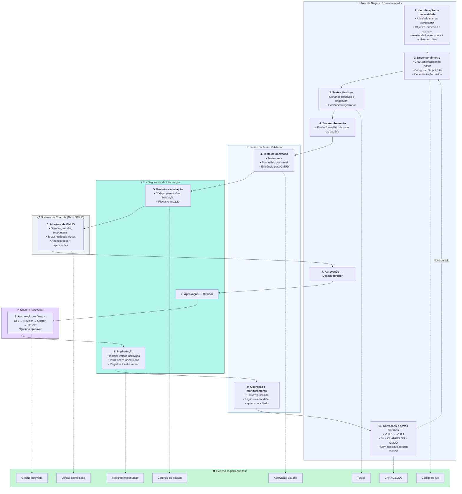

# Processo de Desenvolvimento, Validação e Implantação de Automações Internas com Rastreabilidade e Controle de Auditoria

Fluxograma BPMN com raias (swimlanes) para governança de scripts e aplicações Python internas, com requisitos de rastreabilidade compatíveis com auditoria (ex.: PCI DSS).

## Visualização

Abra o arquivo HTML para visualização completa com layout corporativo:

**[fluxograma-governanca-automacoes-internas.html](./fluxograma-governanca-automacoes-internas.html)**

## Raias (Swimlanes)

| Raia | Responsabilidade |
|------|------------------|
| **Área de Negócio / Desenvolvedor** | Identificação, desenvolvimento, testes técnicos e encaminhamento |
| **Usuário da Área / Validador** | Teste de aceitação e operação |
| **TI / Segurança da Informação** | Revisão técnica, aprovação de segurança e implantação |
| **Gestor / Aprovador** | Aprovação formal da mudança |
| **Sistema de Controle (Git + GMUD)** | Versionamento e registro formal de mudanças |

## Fluxograma (Mermaid)

## Resumo das etapas

1. **Identificação** — Documentar necessidade e avaliar sensibilidade dos dados.
2. **Desenvolvimento** — Código Python versionado no Git com documentação.
3. **Testes técnicos** — Validação com evidências (positivo/negativo/erro).
4. **Aceitação do usuário** — Formulário de teste real com retorno por e-mail.
5. **Revisão técnica** — TI/Security avalia código, permissões e riscos.
6. **GMUD** — Mudança formal com anexos e plano de rollback.
7. **Aprovação** — Cadeia: Desenvolvedor → Revisor → Gestor → TI/Security.
8. **Implantação** — Versão aprovada instalada com registro.
9. **Operação** — Uso monitorado com logs quando aplicável.
10. **Evolução** — Nova versão sempre com rastreabilidade completa.

## Evidências para auditoria

- Código-fonte versionado no Git
- Histórico de alterações (CHANGELOG)
- Versão identificada (tag/release)
- Testes realizados (técnico + aceitação)
- Aprovação formal do usuário
- GMUD aprovada e arquivada
- Registro de implantação
- Controle de acesso e permissões
